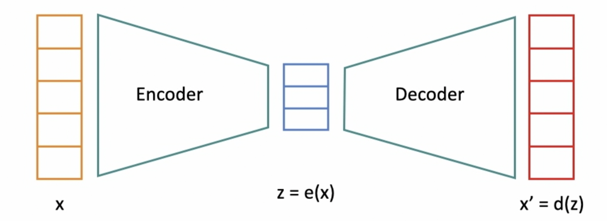
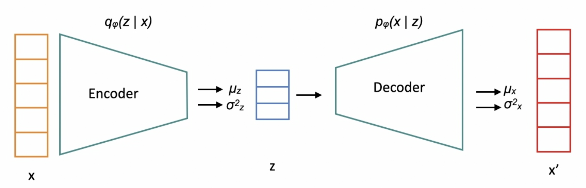

# AutoEncoders 
AutoEncoders are Neural Networks used for dimentionality reduction

## Traditional AutoEncoders

- This Neural Network extracts the latent or significant features from the underlying data
- Latent features are those features that capture as much information as possible present in the original input
- 
    - The encoder extract the latent features
    - z is the lower dimentionality representation or latent features of x
    - The decoder tries to regenerate the riginal input x using latent features z
- The decoder suceeds if the x' image is as close as to x

## Variational AutoEncoders (VAEs)

- These are also called probablistic AutoEncoders i.e. they are probablistic in nature
    - The output of the VAE is partially determined by chance even after training it i.e. given a particular input the output of VAE is not always the same
    - The output is not deterministic but instead probablistic so for a given input there is always possibility that the outpt be different at different times
- They are generative in nature i.e. they can generate new instances [new data formed] that look like the training data
- 
    - The encoder produces the distribution over a latent variable z
    - The distrubution has a certain mean and standard deviation
    - From this encoding a particular encoding can be sampled [the actual coding is sampled randomly from the Gaussian Distribution for the latent z]
    - The sample decoding is fed to the decoder network
    - Decoder prodduces a distribution over data x given latents z 

***Regular AutoEncoders try to reconstruct the original image [input] at the output but they are not generative.