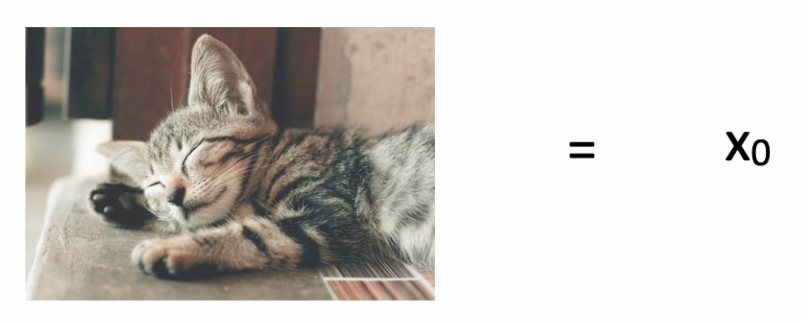
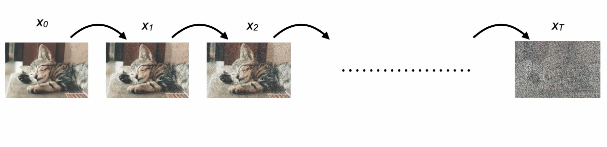
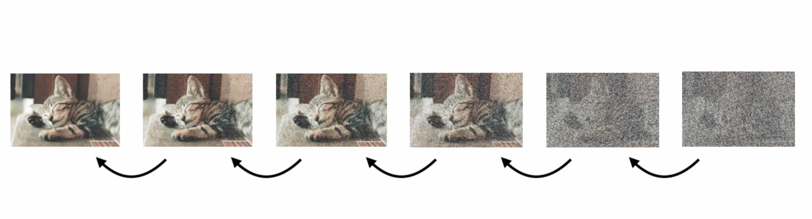

# Denoising Diffusion Probablistic Models

Denoising Diffusion Probablistic Models belong to a class of neural networks - Generative Netwokrs

- Generative model for high-quality image synthesis
- Uses forward diffusion process
    - Incrementally adds noise to an image
    - Neural network is setup that tries to reverse the diffusion which generates image
- [Understand Diffusion Models better](https://arxiv.org/pdf/2006.11239)
- Diffusion Model is also known by the name of Variational AutoEncoder (VAE)
- [Understanding AutoEncoders](AutoEncoders.md)
---

***Metric sed to access the quality of mages created by the generative model is FID : Fréchet Inception Distance, Perfect FID score is 0.0. Lower the FID Score better the generated images are***

---

## How Diffusion Models work

- ***Step 1:*** Start with a base image from data sample [call it Xo]

- ***Step 2:*** Add noise to the image in a very specific manner i.e. iteratively in very minute step sizes [usually of order of 1000 steps in practical implementation]
    - The noise add is independent Gaussian noise at each step
    - The noise added should have relatively very small difference
    - This is done till we get pure noise similar to static i.e. original image is not identifiable

***This process of add noise iteratiely is called forward diffusion process***
- ***Step 3:*** Do the reverse diffusion process to generate image from the static/noise gained
    - It is possible if the noise is added as suggested in step 2
    - Can use a neural network to learn the parameters of the reverse diffusion process
    - Diffusion model is used to learn the reverse diffusion process given that the noise in the forward process is known

---

## Forward Diffusion Process

- In this, starting point is a base image say Xo and with each step we add some Gauss noise to it

Say X1,X2 ........ , XT

T theoretically is infinite but during practical cases it varies from range 1000 to 4000

Now the noise is added such that : 

q(XT | Xo) ≈ N(0,1) ***The final image generated XT given Xo is of Gaussian distribution with mean of 0 and variance of 1***

- In the Forward Diffusion Process is modelled as a Markov Process i.e. each step is independent of the other step before it

[Markov chain is a stochastic model describing a sequence of events where the probability of each event depends only on the previous state]

So each transition n the process only depends on the just previous state and is independent of all the previous or the upcoming states

Each Transition is a Gaussian with a mean and variance : 

$q(x_t \mid x_{t-1}) = \mathcal{N} \left( x_t ; \sqrt{1 - \beta_t} \, x_{t-1}, \beta_t I \right)$

The variance is $beta_t$ whcih indicates that it is added using predefined scedule and is a hyperparameter of the training process

Note that $beta_1 < beta_2 < beta_3 ....... < beta_t$  BUT $beta_t$ is always between 0 and 1

---

## Reverse Diffusion Process

- In this, starting point is XT and from that we generate an image from the data distribution i.e. generate image that looks like/similar to image in the training data

The Reverse Diffusion Process is also modelled as a Markov Chain

The Neural Network in the Diffusion Model is essentially build to learn the paramenters of the transition in the Reverse Process

Given any image at instance t, we can get to its previous instance t-1 and it is represented by p theta given by: 

$p_{\theta}(x_{t-1} \mid x_t) = \mathcal{N} \left( x_{t-1} ; \mu_{\theta}(x_t, t), \Sigma_{\theta}(x_t, t) \right)$

The reverse transition is similar to that of the forward transition i.e. has the same functional form which is gaussian with a certain mean and variance.

The distribution here depends on sample at time instance t 

The neural network learns to undo the noise that is being added at individual steps which is possible only because the noise was added incrementally and iteratively.

The neural network learns this process by learning the mean and variance of the denoising process in order to generate image from noise

---

## Training a Diffusion Model: Intution

- Training a Diffusion model involves using a Neural Network ti apploximate the Reverse Diffusion
- The forward diffusion process looks similar to that of the encoder entwork of the Variational AutoEncoders
- The reverse process looks similar to that of the decoder of the Variational AutoEncoders
- The difference between the VAEs and Diffusion model lies in the forward diffusion process where the noise is added in a very specific way.

---

[CODE IMPLEMENTATION](https://drive.google.com/drive/folders/10KeH00qdy70mv61fjln_ztrBbVCsWYmw?usp=sharing)